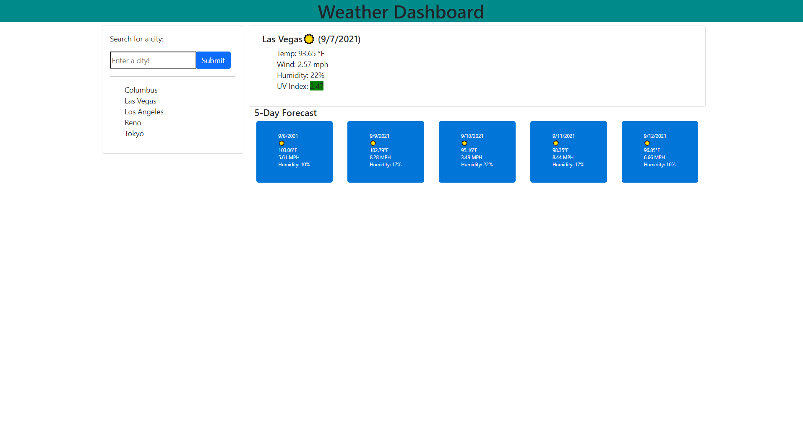

# Server-Side-Api-WeatherDashBoard

Description: Weather Dashboard - user types in city name, and is given current day weather, and a 5 day forecast. Provides user with current date, icon displaying weather conditions, temperature, windspeed, humidity, and UV INDEX, for current day. Then for fiveday forcast provides user with future day, weather icon, temperature, windspeed, and humidity.

Skills Learned:

- How to use OpenWeather's API's in order to get information on inputted city

- parse through returned data, and display on screen relevant information

-  Create updating search history list, with click function to check on weather

- Use different API's in conjuction with eachoter.

To do:

- Improve styling, and maybe adjust fonts. 

Created using: Javascript, HTML,CSS, and OpenWeather API's

Credits:

Jacob Gasper

[Website Link](https://jcgasper.github.io/Weather-Dashboard/ "Website Link")

[Github Repo](https://github.com/jcgasper/Weather-Dashboard "Github Repo")

